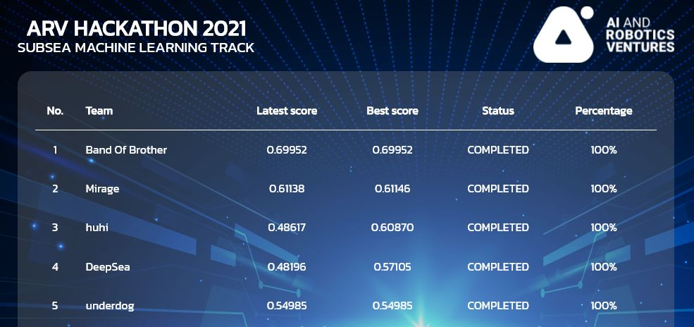

# Subsea Object Detection (Hackathon)

2nd place solution from [AI and Robotics Hackathon 2021](https://www.arvhackathon2021.riseaccel.com/)

Our team's [Presentation](https://github.com/markvasin/subsea-object-detection/blob/master/Presentation.pdf)

### Scoreboard



## How to run

1. Install dependencies

```bash
# install dependencies using conda environment  
cd arv-hack-mirage
conda create --name mirage python=3.7
conda create --name yolo python=3.7

conda activate mirage
pip install -r requirements.txt
 ```   

2. Download dataset from https://drive.google.com/drive/folders/1S1HDPKBq78cHq6BIu8ctTouae01N7pzj and put it in data folder


3. Build and test docker images locally

```bash
docker build -t test .
docker run --rm -e path=test -p 8000:8000 test
```
#### Example payload:

```javascript
{"url":"https://rovula.com/image.png","image_id":1}
```

#### Example cURL:

```bash
curl -X POST \
  http://localhost:8000/test/predict \
  -H 'accept: application/json' \
  -H 'content-type: application/json' \
  -d '{"url":"https://github.com/Rovula/hackathon-fastapi/blob/master/doc/20201107122805838.png?raw=true","image_id":20201107122805838}'
```

#### Response:

```javascript
{
    "image_id": 1,
    "bbox_list": [{
        "category_id": 0,
        "bbox": {
          "x": 0,
          "y": 220.66666666666669,
          "w": 1050.0986882341442,
          "h": 525.3333333333333
          },
        "score": 0.63508011493555
      }]
};
```


## YOLO


```bash 
conda activate yolo
cd yolov5
python train.py --img 640 --batch 64 --epochs 100 --data ./roboflow.yaml --weights yolov5m.pt --cache

python train.py --img 640 --batch 40 --epochs 150 --data data.yaml --weights yolov5m.pt --cache
python train.py --img 640 --batch 40 --epochs 200 --data ../synthetic-v1/data.yaml --weights yolov5m.pt --cache

python train.py --img 640 --batch 40 --epochs 200 --data data.yaml --weights /home/ec2-user/yolov5/runs/train/exp21/weights/best.pt --cache 

python train.py --img 640 --batch 40 --epochs 200 --data data.yaml --weights yolov5m.pt --hyp hyp_evolve.yaml --cache

python train.py --img 640 --batch 40 --epochs 100 --data data.yaml --weights /home/ec2-user/yolov5/runs/train/exp23/weights/best.pt --cache
python train.py --img 640 --batch 40 --epochs 150 --data data.yaml --weights syn-v2-ep10.pt --cache
python train.py --img 640 --batch 40 --epochs 200 --data data.yaml --weights /home/ec2-user/yolov5/runs/train/exp13/weights/best.pt --cache

